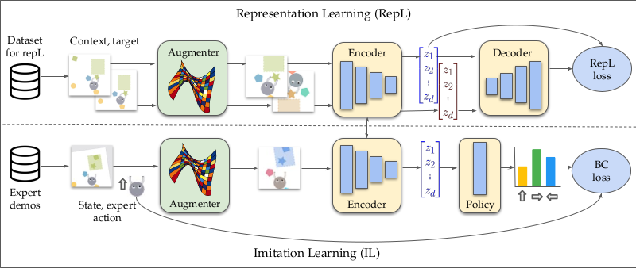

# The Empirical Investigation of Representation Learning for Imitation (EIRLI)

Over the past handful of years, representation learning has exploded as a
subfield, and, with it have come a plethora of new methods, each slightly
different from the other.

Our Empirical Investigation of Representation Learning for Imitation (EIRLI) has
two main goals:

1. To create a modular algorithm definition system that allows
   researchers to easily pick and choose from a wide array of commonly
   used design axes
2. To facilitate testing of representations within the context of
   sequential learning, particularly imitation learning and offline
   reinforcement learning

## Common Use Cases

Do you want to…

- Reproduce our results? You can find scripts and instructions
  [here](https://il-representations.readthedocs.io/en/latest/reproduction_scripts.html#reproduction)
  to help reproduce our benchmark results.
- Design and experiment with a new representation learning algorithm using our
  modular components? You can find documentation on that
  [here](https://il-representations.readthedocs.io/en/latest/representation_learner_usage.html#define-new)
- Use our algorithm definitions in a setting other than sequential learning? The
  base example
  [here](https://il-representations.readthedocs.io/en/latest/representation_learner_usage.html#pre-defined)
  demonstrates this simplified use case

Otherwise, you can see our [full ReadTheDocs documentation here](https://il-representations.readthedocs.io/en/latest/index.html).

## Modular Algorithm Design

This library was designed in a way that breaks down the definition of a
representation learning algorithm into several key parts. The intention
was that this system be flexible enough many commonly used algorithms
can be defined through different combinations of these modular
components.

The design relies on the central concept of a "context" and a "target".
In very rough terms, all of our algorithms work by applying some
transformation to the context, some transformation to the target, and
then calculating a loss as a function of those two transformations.
Sometimes an extra context object is passed in

Some examples are:

- In **SimCLR**, the context and target are the same image frame, and
  augmentation and then encoding is applied to both context and target. That
  learned representation is sent through a decoder, and then the context and
  target representations are pulled together with a contrastive loss.
- In **TemporalCPC**, the context is a frame at time t, and the target a frame
  at time t+k, and then, similarly to SimCLR above, augmentation is applied to
  the frame before it's put through an encoder, and the two resulting
  representations pulled together
- In a **Variational Autoencoder**, the context and target are the same image
  frame. An bottleneck encoder and then a reconstructive decoder are applied to
  the context, and this reconstructed context is compared to the target through
  a L2 pixel loss
- A **Dynamics Prediction** model can be seen as an conceptual combination of an
  autoencoder (which tries to predict the current full image frame) and
  TemporalCPC, which predicts future information based on current information.
  In the case of a Dynamics model, we predict a future frame (the target) given
  the current frame (context) and an action as extra context.

This abstraction isn't perfect, but we believe it is coherent enough to
allow for a good number of shared mechanisms between algorithms, and
flexible enough to support a wide variety of them.

The modular design mentioned above is facilitated through the use of a
number of class interfaces, each of which handles a different component
of the algorithm. By selecting different implementations of these shared
interfaces, and creating a RepresentationLearner that takes them as
arguments, and handles the base machinery of performing transformations.

1. TargetPairConstructer - This component takes in a set of trajectories
   (assumed to be iterators of dicts containing 'obs' and optional 'acts',
   and 'dones' keys) and creates a dataset of (context, target, optional extra
   context) pairs that will be shuffled to form the training set.
2. Augmenter - This component governs whether either or both of the
   context and target objects are augmented before being passed to the
   encoder. Note that this concept only meaningfully applies when the
   object being augmented is an image frame.
3. Encoder - The encoder is responsible for taking in an image frame and
   producing a learned vector representation. It is optionally chained
   with a Decoder to produce the input to the loss function (which may
   be a reconstructed image in the case of VAE or Dynamics, or may be a
   projected version of the learned representation in the case of
   contrastive methods like SimCLR that use a projection head)
4. Decoder - As mentioned above, the Decoder acts as a bridge between
   the representation in the form you want to use for transfer, and
   whatever input is required your loss function, which is often some
   transformation of that canonical representation.
5. BatchExtender - This component is used for situations where you want
   to calculate loss on batch elements that are not part of the batch
   that went through your encoder and decoder on this step. This is
   centrally used for contrastive methods that use momentum, since in
   that case, you want to use elements from a cached store of
   previously-calculated representations as negatives in your
   contrastive loss
6. LossCalculator - This component takes in the transformed context and
   transformed target and handles the loss calculation, along with any
   transformations that need to happen as a part of that calculation.

## Training Scripts

In addition to machinery for constructing algorithms, the repo contains a set of
Sacred-based training scripts for testing different Representation Learning
algorithms as either pretraining or joint training components within an
imitation learning pipeline. These are likeliest to be a fit for your use case
if you want to reproduce our results, or train models in similar settings
